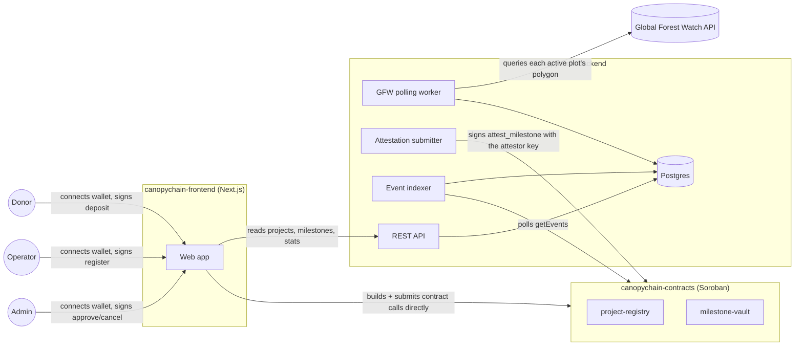

# Architecture

Canopychain is three cooperating pieces, plus this docs site. The most
important thing to understand about the split: **the contracts are the
only source of truth.** The backend's database is a read-optimized mirror
of on-chain state, not a second copy of it — nothing is true because the
backend says so, only because the chain says so. The one deliberate
exception — the backend's attestor key — is called out explicitly below
and in [the attestation model doc](./attestation-model.md).

## The contracts (source of truth)

Two Soroban contracts, deployed independently:

- **project-registry** — operators register a project with `register`
  (name, polygon hash, recipient, attestor), and an admin activates it
  with `approve_project`. Owns exactly one fact per project: whether it's
  approved to receive funding.
- **milestone-vault** — holds every project's pooled donor escrow. Donors
  call `deposit`; the configured attestor calls `attest_milestone` to
  release the next tranche; an admin can `cancel_project`, after which
  donors call `refund` to reclaim their proportional share of whatever
  wasn't released. It doesn't check the registry itself — a vault can be
  opened for any project id, which is a deliberate choice discussed more
  in the deployment guide.

Both emit events on every state change. That event stream is the *only*
channel the backend uses to learn what happened — there's no other
integration point between the backend and the contracts.

## The backend

The indexer polls the contracts' events on an interval and turns each one
into a write against a normal relational schema: `projects`, `donors`,
`project_donations`, `milestones`. This exists purely so the frontend can
ask questions like "list approved projects" or "show this project's
milestone timeline" without scanning on-chain event history on every page
load.

Two pieces here have no equivalent in a purely read-mirroring backend:

- **The GFW polling worker** queries the Global Forest Watch API for each
  active project's polygon on a schedule and computes forest-cover change
  since the last check, storing the result as a snapshot.
- **The attestation submitter** is the one place in this entire system a
  private key lives server-side. When the milestone evaluator decides a
  project's next threshold has been crossed, this component signs and
  submits `attest_milestone` using the backend's configured attestor key.
  This is the semi-trusted-attestor design described in
  [The Milestone Attestation Model](./attestation-model.md) — a
  disclosed, deliberate exception to "the backend never signs," not an
  accident of implementation.

Outside of that one path, **the backend never holds donor or operator
funds, and never signs on their behalf.** Every other contract call in the
system — deposit, register, approve, cancel, refund — is built and signed
in the user's own browser, using their own wallet. If the backend
disappeared entirely, every project's escrowed funds would stay exactly
where the contract put them; only new attestations (and the dashboard)
would stop.

## The frontend

A Next.js app that does two distinct things, deliberately kept separate:

- **Reads** (project lists, stats, a donor's donations) go to the backend
  API — fast, queryable, and fine to be a few seconds stale, since it's
  just a view.
- **Writes** (funding a project, registering one, an admin's
  approve/reject/cancel/rotate-attestor) go straight from the browser to
  the contracts via
  [`@stellar/stellar-sdk`'s contract client](https://developers.stellar.org/docs/build/guides/transactions/invoke-contract-tx-sdk),
  signed by whichever wallet the user connected through
  [Stellar Wallets Kit](https://stellarwalletskit.dev/). The backend is
  never in this path.

That split is why a stale indexer is an inconvenience, not a security
problem: it can only ever make the *dashboard* wrong, never the contracts.
