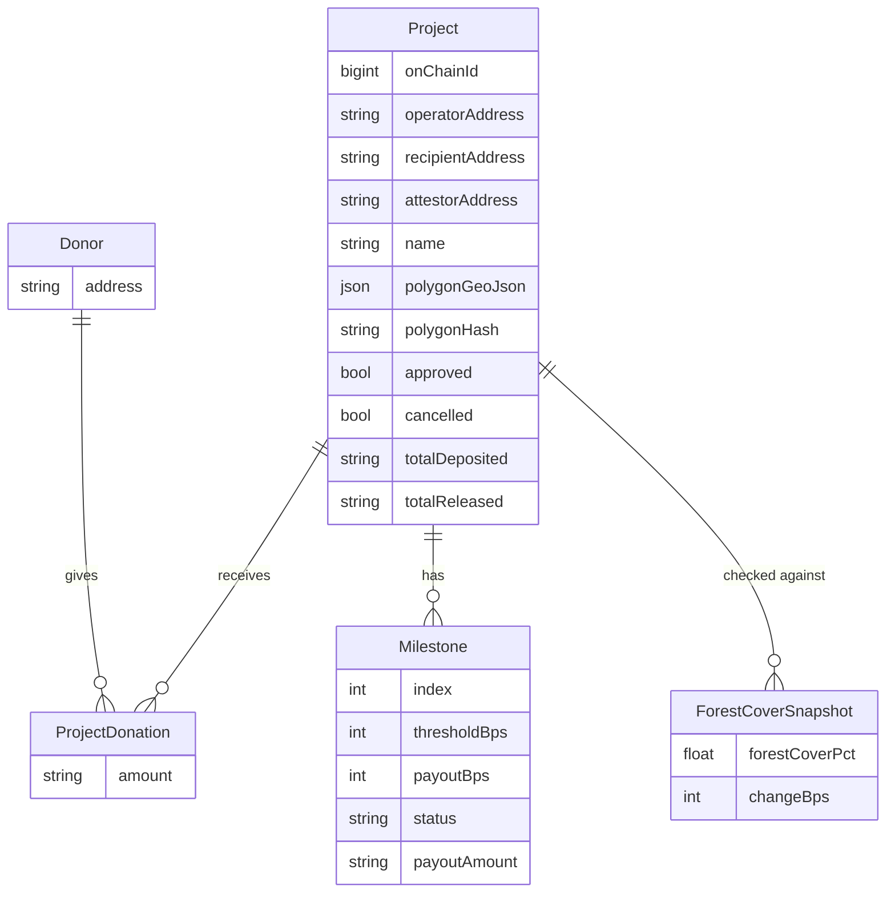

# The backend's data model

[Architecture](./architecture.md) says the backend's database is "a
read-optimized mirror of on-chain state, not a second copy of it." This
page is what that mirror actually looks like: the tables, how they relate,
and — for every column — whether it's written by the event indexer (and
therefore only ever as fresh as the last on-chain event it's processed) or
by the operator-registration intake (`POST /projects/register`, an
off-chain call the indexer never sees). That distinction is what separates
"the indexer is behind" from "the intake never happened" when a value looks
stale or missing.

`canopychain-backend` uses Prisma against PostgreSQL
([`prisma/schema.prisma`](https://github.com/canopychain/canopychain-backend/blob/main/prisma/schema.prisma)).

## `projects`

One row per on-chain project id. Its columns split cleanly by where they
come from:

| Column | Source | Notes |
| --- | --- | --- |
| `onChainId` | Indexer, from `register` | The id shared with `milestone-vault` — see [Architecture](./architecture.md). |
| `operatorAddress`, `name` | Indexer, from `register` | The *only* two fields the on-chain `register` event actually carries besides the id. |
| `approved` | Indexer, from `approved` | Flipped `true` when `project-registry`'s `approve_project` fires. Never flipped back — there's no on-chain "unapprove". |
| `totalDeposited` | Indexer, from `deposit` | Set directly from the event's running-total field, not accumulated locally. |
| `totalReleased` | Indexer, from `attested` | The event only carries that one payout, so this *is* accumulated locally: previous value plus this payout. |
| `cancelled`, `reviewNote` | Off-chain, from `POST /projects/:id/reject` | Set when an admin rejects a still-pending project — see the caveat below, this is **not** currently how an on-chain `cancel_project` reaches this column. |
| `recipientAddress`, `attestorAddress`, `polygonGeoJson`, `polygonHash` | Off-chain, from `POST /projects/register` | `null` until an operator's registration intake attaches them — the `register` event alone doesn't carry any of the four. See the [API reference](./api-reference.md#post-projectsregister). |

A `projects` row can exist before either of its two writers has run:
a `deposit` event arriving before the matching `register` event (the
indexer started mid-history, or the events raced) creates a placeholder
row — empty `operatorAddress`, a generated name — rather than being
dropped; the real `register` event fills it in later without clobbering
whatever's already there. The same "either order, same end state" property
holds between the `register` event and the registration intake.

### The `cancelled` column doesn't (yet) mirror `cancel_project`

Worth being precise about, since it's easy to assume otherwise: the
indexer's `milestone-vault` handler only acts on `deposit` and `attested`
events. `cancelled`, `refund`, `schedule`, `pause`, `unpause`, and
`attestor` are deliberately left unhandled for now — none of them are
needed for the donor-facing explorer or milestone timeline *yet*. That
means today, calling `cancel_project` for an already-approved project (the
[stalled-project path](./stalled-projects.md)) changes the vault's own
on-chain `cancelled` flag immediately, but does **not** flip this table's
`cancelled` column — the only writer of that column right now is the
pre-approval rejection endpoint. If you need to know whether a project is
actually cancelled on-chain, read `milestone-vault`'s `get_vault` directly
rather than trusting this column; see
[What happens to a stalled project](./stalled-projects.md).

## `milestones`

One row per tranche in a project's schedule, `(projectId, index)` unique.

| Column | Source |
| --- | --- |
| `index`, `thresholdBps`, `payoutBps` | Written when the schedule is first configured — mirrors `configure_milestones`'s arguments. |
| `status`, `attestedAt`, `payoutAmount` | Indexer, from `attested`. The event's `milestones_completed` count tells the handler which index just advanced (`milestones_completed - 1`), so it can flip that one row from `PENDING` to `ATTESTED` without re-deriving state from scratch. |

## `project_donations`

One row per `(project, donor)` pair — **a donor's cumulative total for that
project, not one row per deposit.** Every `deposit` event only carries that
single call's amount, so the handler reads the donor's existing total for
the project, adds the new amount, and writes the sum back; a donor who
funds a project three times still has exactly one row here, not three.
There's no separate table of individual deposit transactions — if you need
that history, the on-chain event log is the only source of it.

## `forest_cover_snapshots`

One row per Global Forest Watch check the polling worker ran against a
project's polygon: the computed `forestCoverPct`, the signed `changeBps`
against the previous check, and the raw API response for debugging. This
table has no equivalent on-chain event at all — it's the backend's own
working data for the milestone evaluator (see
[Forest-Cover Metric & Limitations](./forest-cover-metric.md)), not a
mirror of anything the contracts emit. It's also not currently exposed by
any public API endpoint (see the [API reference](./api-reference.md)) —
reading it means direct database access, not a request a donor-facing
client can make.

## `donors`

One row per address that's ever deposited, created lazily by the first
`deposit` event the indexer sees from that address. Nothing here is
written off-chain.

## `indexer_checkpoints`

A single row tracking the last ledger the indexer has processed, so a
restart resumes from where it left off instead of re-scanning event history
from "now." Internal bookkeeping, not part of the donor- or operator-facing
data model above.
